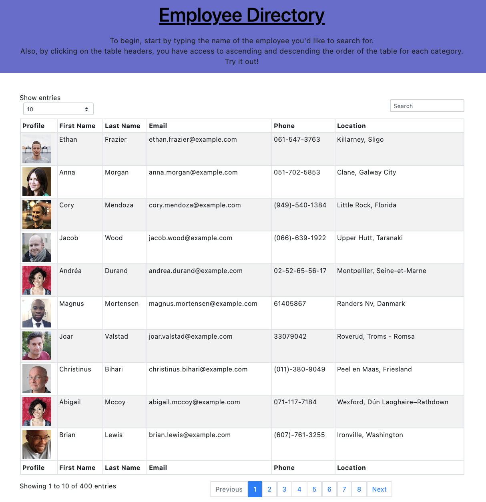

# React-Employee-Directory [](https://opensource.org/licenses/MIT)

## Description

As a full-stack developer, we want to be able to create an application directory for employees using React, its library, and a random user api in order to build an interactive user interface. A given user can search for the employee(s) by typing it into the search bar which should populate the results if any. This React UI also can be seen populating the first name, last name, and location in ascending or descending order by clicking on the column header names to perhaps simplify your search for that employee. With the show entries feature, a user is also able to populate as little or as many employees to the page as they would like.   

## User Story

```
As a user, I want to be able to view my entire employee directory at once so that I have quick access to their information.
```

## Table of Contents
* [Description](#description)
* [User Story](#userstory)
* [Installation](#installation)
* [Usage](#usage)
* [License](#license)
* [Contributing](#contributing)
* [Tests](#tests)
* [Criteria](#criteria)
* [Application](#application)
* [Questions](#questions)

## Installation 

* Bootstrap
* Axios
* MDB React

## Usage

* React
* Javascript
* gitHub Pages
* Random User Api
* HTML
* MDB React

## License

* This project is licensed under an MIT license.

## Contributing 

N/A

## Tests

To run test, run the following commands:

```
* npm i then
* npm start 
* Note: Go to localhost:3000 within your browser
```

## Criteria

```
Given a table of random users generated from the [Random User API](https://randomuser.me/), when the user loads the page, a table of employees should render. 

The user should be able to:

  * Sort the table by at least one category

  * Filter the users by at least one property.
```

## Application

* [Deployed Application](https://samya129.github.io/React-Employee-Directory/)
* [Demo Video](https://drive.google.com/file/d/1bMsy0UJXAj8B6xYjJRehWXoRzngoSZco/view)


## Questions

* If you have any questions regarding this repository, contact me either by email at Samyaf020@gmail.com, or you can find more of my work within my github account attached here [Github](https://github.com/Samya129). Here, you can also open an issue if needed.
